## part1. создание ВМ, версия Ubuntu.

```
cat /etc/issue
```

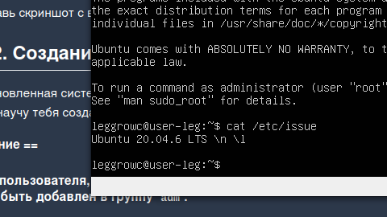

## part2. Создание пользователя

```
sudo adduser max
```

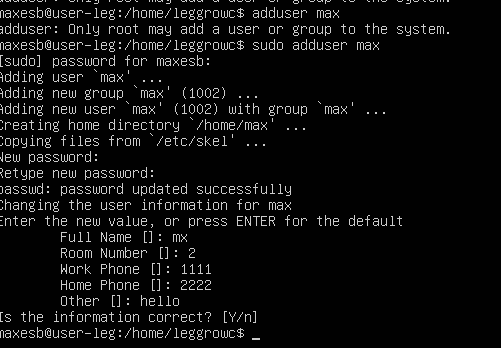
```
sudo addgroup adm max
```

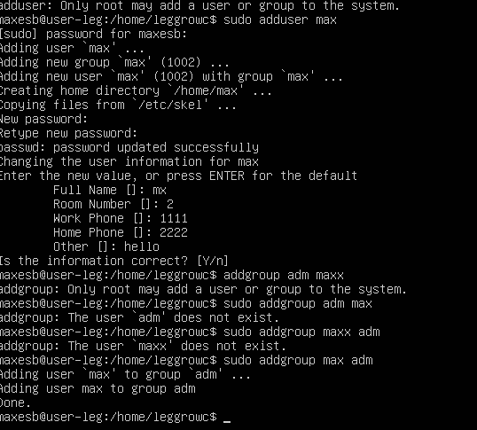
```
sudo cat /etc/passwd
```


## Part 3. Настройка сети ОС
###В Linux интерфейс lo (“loopback”) — это виртуальный сетевой интерфейс, присутствующий по умолчанию во всех Unix-подобных операционных системах/

Интерфейс lo предназначен для сетевого взаимодействия программ внутри одного компьютера.

Его IP-адрес — 127.0.0.1, также известен как localhost.

Через lo приложения могут посылать и получать сетевые пакеты себе же, минуя “внешнюю” сеть и физические интерфейсы.

Пример: если на вашей машине запущен web-сервер, запрос по адресу http://127.0.0.1/ не выходит за пределы устройства и обрабатывается локально.

Интерфейс lo критически важен для локальной работы серверов, тестирования сетевых приложений, внутренней коммуникации программ и функционирования самой ОС.

Если lo отключить или удалить, ряд сетевых сервисов перестанет работать корректно, а некоторые операции вообще станут невозможны.

### DHCP — это аббревиатура от Dynamic Host Configuration Protocol (протокол динамической настройки узла).
Объяснение DHCP

DHCP — сетевой протокол, который позволяет устройствам автоматически получать IP-адрес и другие сетевые параметры (DNS, шлюз и пр.) для работы в локальной или глобальной сети. Протокол работает по модели «клиент–сервер»: когда устройство подключается к сети, оно обращается к DHCP-серверу и получает необходимые настройки без ручного вмешательства сетевого администратора.

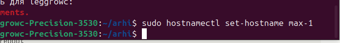
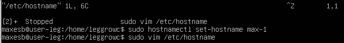

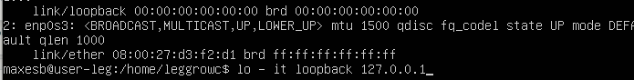
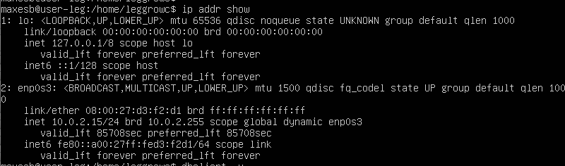
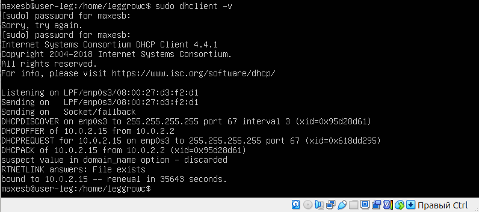
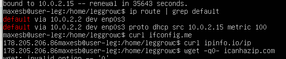
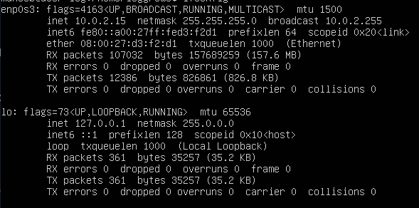
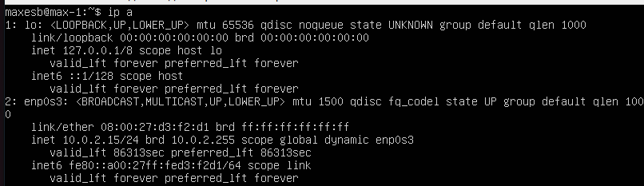
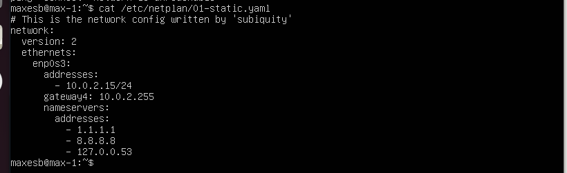
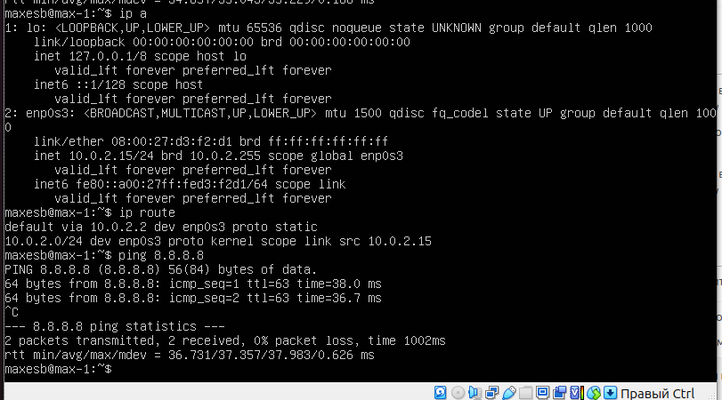
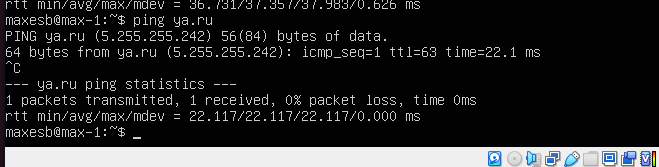
