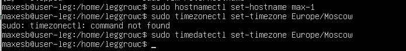

## part1. создание ВМ, версия Ubuntu.

```
cat /etc/issue
```


## part2. Создание пользователя

```
sudo adduser max
```


```
sudo addgroup adm max
```


```
sudo cat /etc/passwd
```


## Part 3. Настройка сети ОС





